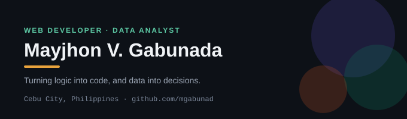
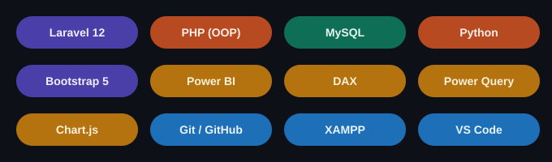
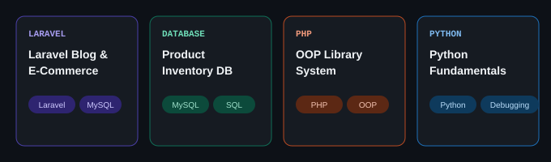
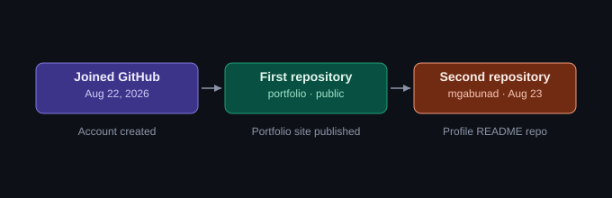

# Hi, I'm Mayjhon 👋

Full Stack Web Developer & Data Analyst based in Cebu, Philippines — developing web applications with Laravel and working with data to find clear insights.

- 🎓 Building skills in Full Stack Web Development and Full Stack Data Analytics at CIIT College, plus a Data Analyst program at ExcelHelpline.ph
- 💻 Recent build: a Laravel 12 multi-user blog/e-commerce platform with role-based auth, custom middleware, and full CRUD
- 📊 On the data side: SQL/MySQL (window functions, CTEs), Power BI, Excel, and Python
- 📄 [View my resume](https://raw.githubusercontent.com/mgabunad/portfolio/main/Mayjhon_Gabunada_Resume.pdf)
- 🌐 [View my portfolio](https://mgabunad.github.io/portfolio/Mayjhon_Gabunada_Portfolio.html)
- 📬 Reach me at mayjhongabunada13@gmail.com

## Tech Stack

**Languages & Frameworks:** PHP · Laravel 12 · Python · HTML/CSS · Bootstrap 5

**Databases:** MySQL · SQL

**Data & Visualization:** Power BI · Excel · Chart.js

**Tools:** Git & GitHub · VS Code · XAMPP

## Featured Project

**[Laravel Blog & E-Commerce Platform](https://github.com/mgabunad/portfolio)**
A Laravel 12 application built with role-based authentication and authorization, custom middleware, avatar uploads, and full CRUD across products, orders, and posts.

## GitHub Journey

